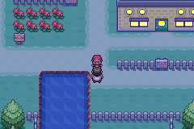

# What is this?
A C-Injection project that inserts a custom Audio Player to your BPRE (FireRed v1.0) ROM. Can work on both Vanilla and [HUBOL](https://github.com/haven1433/HexManiacAdvance/wiki/Haven's-Unofficial-Build-Of-Leon's-Dynamic-Pokemon-Expansion---Complete-FireRed-Upgrade-Rombase) versions.

# Table of Contents
- [Features](#features)

- [Build Instructions](#build-instructions)

- [Configuration](#configuration)

- [Adding/Removing Songs](#addingremoving-songs)

- [Accessing In-Game](#accessing-in-game)

- [Results](#results)

- [Credits](#credits)

## Features
- **Dynamic Compilation** - The [CFRU](https://github.com/Skeli789/Complete-Fire-Red-Upgrade) build system allows you to recompile as many times as you'd like without having to worry about repointing. The variable `OFFSET_TO_PUT` in `scripts/make.py` and `scripts/insert.py`, lets you specify where routine will be inserted in the ROM. You may also disable automatic free‑space searching with the `SEARCH_FREE_SPACE` flag.

- **Easy Configuration** - Adding new menu items will just take a few edits' worth of your time.

- **Bonus Page Toggle** - You can choose to have a **Bonus Page**, or not. Just a matter of commenting/uncommenting a line from the config.

## Build Instructions
If you're familiar with the CFRU, you can skip this step since they use the same build system and head to [Configuration](#configuration).

### Prerequisites
- **Your BPRE ROM (ofc)** - Name it `BPRE0.gba` and paste it on the root folder.

- [Python 3.7.6](https://www.python.org/downloads/release/python-376/) - Don't forget to check the **Add Python 3.7 to PATH** option during the installation.

- [devkitPro](https://www.mediafire.com/file/ylybp19980gl5yx/devkitPro.zip/file)
    - Extract the contents to **C Drive**.
    - Search **Edit Environment Variables** in your Search Bar next to the Start Menu and click on the first option that pops up. Then click on **Environment Variables**, then **Path** on the top window and then **Edit**.
    - Click on **New** and paste this: `C:\devkitPro\devkitARM\bin`.
    - Save by clicking **OK**.

### Commands
- Run `python scripts/make.py` to build the required `test.gba` output.

- Run `python  scripts/clean.py all` to remove previously built object files in case of a recompile. Then run the command above to rebuild.

**NOTE: Run these commands from the ROOT folder!**

## Configuration
This section lists the macros you can edit for your own build in `src/config.h`.

### Appearance
| Macro | Description | Default |
| :---: | :---------: | :-----: |
| `COLOR_MENU_TITLE` | Title text color | `White` |
| `COLOR_DESCRIPTION` | Description text color | `White` |
| `COLOR_MENU_ITEM` | Unselected menu item text color | `Black` |
| `COLOR_MENU_SELECTED_ITEM` | Selected menu item text and cursor color | `White` |
| `COLOR_PREVIOUS_NEXT` | Previous/Next page text color | `White` |

### General
| Macro | Description | Default | Notes |
| :---: | :---------: | :-----: | :---: |
| *`BONUS_PAGE` | Adds the bonus page | `TRUE` | - |
| `VAR_AUDIO_PLAYER_PAGE` | Stores player's last visited page | `0x51FC` | **Change for Vanilla ROMs!** |
| `VAR_AUDIO_PLAYER_MAIN_INDEX` | Stores player's index in the main page | `0x51FD` | **Change for Vanilla ROMs!** |
| *`VAR_AUDIO_PLAYER_BONUS_INDEX` | Stores player's index in the bonus page | `0x51FE` | **Change for Vanilla ROMs!** |
| `VAR_CURRENT_SONG` | Stores the last played song | `0x51FF` | **Change for Vanilla ROMs!** |
| *`FLAG_UNLOCK_BONUS_PAGE` | Flag that unlocks the bonus page when set | `0x1800` | **Change for Vanilla ROMs!** |
| `BLINK_TIMER` | Higher the value, slower the interval between each blink | `45` | - |
| `MENU_ITEM_COUNT` | Number of songs | `10` | - |
| *`BONUS_PAGE_COUNT` | Number of songs in the bonus page | `9` | - |

\* **Bonus Page Macros**

## Adding/Removing Songs
- **Step 1**: Change the number of songs you want in the config file. Macros used: `MENU_ITEM_COUNT` and `BONUS_PAGE_COUNT`. For this example, I will add two songs to the main menu. So I set `#define MENU_ITEM_COUNT 12`.

- **Step 2**: Navigate to `include/new/audio_player.h` and scroll down till you see `/* ========== String Declarations ========== */`. Declare your strings in the same manner:
    ```
    // Menu Items
    extern const u8 gText_MenuItem_1[];
    ...
    ...
    extern const u8 gText_MenuItem_10[];

    extern const u8 gText_MenuItem_11[]; // New Song
    extern const u8 gText_MenuItem_12[]; // New Song

    // Menu Item Descriptions
    extern const u8 gText_MenuItemDesc_1[];
    ...
    ...
    extern const u8 gText_MenuItemDesc_10[];

    extern const u8 gText_MenuItemDesc_11[]; // New Song
    extern const u8 gText_MenuItemDesc_12[]; // New Song
    ```

- **Step 3**: Add your required strings in `strings/audio_player.string`:
    ```
    // Main Menu Items
    ...
    ...
    #org @gText_MenuItem_10
    Song 10

    #org @gText_MenuItem_11
    Song 11

    #org @gText_MenuItem_12
    Song 12

    // Menu Item Descriptions
    ...
    ...
    #org @gText_MenuItemDesc_10
    Song Description 10

    #org @gText_MenuItemDesc_11
    Song Description 11

    #org @gText_MenuItemDesc_12
    Song Description 12
    ```
    Follow the same procedures for the Bonus Menu.

- **Step 4**: Finally, add your songs to the tables in `src/audio_player_data.c`. Scroll until you see: `/* ========== Menu Item Data ========== */`.

## Accessing In-Game
- Get the `offsets.ini` file in the root folder after building and note the offset of `ShowAudioPlayer`.

- Example usage in script, say my offset is `08900A98`:
  ```
  lock
  faceplayer
  msgbox gText_AudioPlayer MSG_NORMAL

  callasm 0x900A99 // Basically, (OFFSET + 1)
  waitstate

  release
  end
  ```

- Useful resource: [Use Script Via Item](https://www.pokecommunity.com/threads/darthatrons-hacks.281573/) by Darthatron on PokeCommunity.

## Results


[](https://www.youtube.com/watch?v=hZYj0DijsAg)

# Credits
- **1RWT16KU1D (Me)** - Project author, for the code and documented instructions.

- **Invis** - For the beautiful menu backgrounds!

- **Shiny Miner, Greenphx, Blurose** - For the code template that they extracted from the CFRU.

- **Skeli** - For the build system. All hail Skeli.
